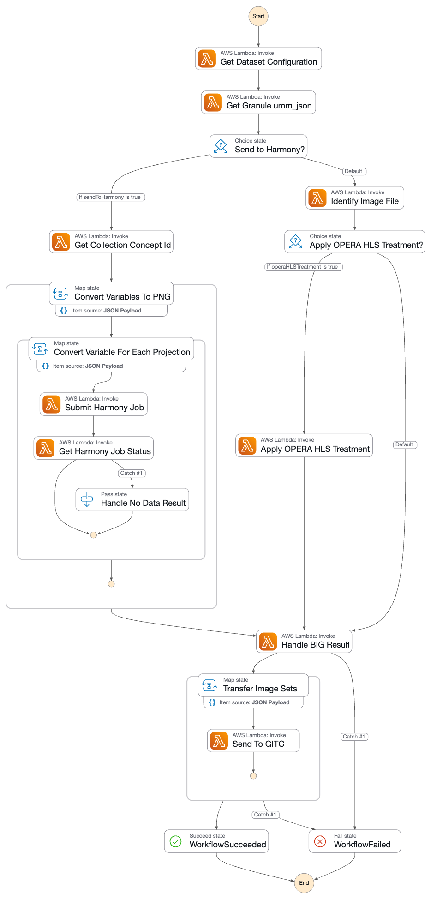

# About

bignbit is a Cumulus module that can be installed as a post-ingest workflow to generate browse imagery via Harmony and then transfer that imagery to GIBS.

In general, the high level steps are:

1. For each requested output projection and configured variable within the granule, generate browse imagery via Harmony and store it in S3.
2. Generate a browse image metadata file for GIBS for each image produced by Harmony.
3. Construct a CNM message for each image that includes the image, metadata, and optional world file
4. Send the CNM messages to GIBS via SQS.
5. Wait for GIBS to process the CNM messages and send a success or failure response back to an SNS topic.
6. Record the result of GIBS processing in S3.

_Visual representation of the bignbit step function state machine:_ 



# Installing this module

1. Add a post-ingest workflow to the cumulus ingest workflow. For example:
    ```
   {
              "StartAt":"BIGChoice",
              "States":{
                 "BIGChoice":{
                    "Type":"Choice",
                    "Choices":[
                       {
                          "And":[
                             {
                                "Variable":"$.meta.collection.meta.workflowChoice.browseimage",
                                "IsPresent":true
                             },
                             {
                                "Variable":"$.meta.collection.meta.workflowChoice.browseimage",
                                "BooleanEquals":true
                             }
                          ],
                          "Next":"QueueGranulesToBIG"
                       }
                    ],
                    "Default":"BIGSucceed"
                 },
                 "QueueGranulesToBIG":{
                    "Parameters":{
                       "cma":{
                          "event.$":"$",
                          "task_config":{
                             "provider":"{$.meta.provider}",
                             "internalBucket":"{$.meta.buckets.internal.name}",
                             "stackName":"{$.meta.stack}",
                             "granuleIngestWorkflow":"BrowseImageWorkflow",
                             "queueUrl": "${aws_sqs_queue.big_background_job_queue.id}"
                          }
                       }
                    },
                    "Type":"Task",
                    "Resource":"${module.cumulus.queue_granules_task.task_arn}",
                    "Retry":[
                       {
                          "ErrorEquals":[
                             "States.ALL"
                          ],
                          "IntervalSeconds":5,
                          "MaxAttempts":3
                       }
                    ],
                    "Catch":[
                       {
                          "ErrorEquals":[
                             "States.ALL"
                          ],
                          "ResultPath":"$.exception",
                          "Next":"BIGFail"
                       }
                    ],
                    "Next": "BIGSucceed"
                 },
                 "BIGFail":{
                    "Type":"Fail"
                 },
                 "BIGSucceed":{
                    "Type":"Succeed"
                 }
              }
   ```
2. Add a new terraform script to the `cumulus-deploy-tf` scripts used to deploy cumulus. This script
should define the bignbit module and the bignbit step function state machine. See an example in [browse_image_workflow.tf](/examples/cumulus-tf/browse_image_workflow.tf).
3. [Configure one or more collections](#configuring-a-collection)

## Module Inputs

This module uses the following input variables:

| Name                                 | Type         | Description                                                                                                                      | Default Value                                                       |
|--------------------------------------|--------------|----------------------------------------------------------------------------------------------------------------------------------|---------------------------------------------------------------------|
| stage                                | string       | Environment used for resource tagging (dev, int, ops, etc...)                                                                    |                                                                     |
| cmr_environment                      | string       | Environment used when querying CMR during GIBS response handling (UAT or OPS)                                                    |                                                                     |
| prefix                               | string       | Prefix used for resource naming (project name, env name, etc...)                                                                 |                                                                     |
| data_buckets                         | list(string) | List of buckets where data is stored. Lambdas will be given read/write access to these buckets.                                  | []                                                                  |
| config_bucket                        | string       | Bucket where dataset configuration is stored                                                                                     |                                                                     |
| config_dir                           | string       | Path relative to `config_bucket` where dataset configuration is stored                                                           | "big-config"                                                        |
| bignbit_audit_bucket                 | string       | S3 bucket where messages exchanged with GITC will be saved. Typically the cumulus internal bucket                                |                                                                     |
| bignbit_audit_path                   | string       | Path relative to `bignbit_audit_bucket` where messages exchanged with GITC will be saved.                                        | "bignbit-cnm-output"                                                |
| bignbit_staging_bucket               | string       | S3 bucket where generated images will be saved. Leave blank to use bucket managed by this module.                                | _create new bucket named svc-${var.app_name}-${var.prefix}-staging_ |
| harmony_staging_path                 | string       | Path relative to `bignbit_staging_bucket` where harmony results will be saved.                                                   | "bignbit-harmony-output"                                            |
| gibs_region                          | string       | Region where GIBS resources are deployed                                                                                         |                                                                     |
| gibs_queue_name                      | string       | Name of the GIBS SQS queue where outgoing CNM messages will be sent                                                              |                                                                     |
| gibs_account_id                      | string       | AWS account ID for GIBS                                                                                                          |                                                                     |
| edl_user_ssm                         | string       | Name of SSM parameter containing EDL username for querying CMR                                                                   |                                                                     |
| edl_pass_ssm                         | string       | Name of SSM parameter containing EDL password for querying CMR                                                                   |                                                                     |
| permissions_boundary_arn             | string       | Permissions boundary ARN to apply to the roles created by this module. If not provided, no permissions boundary will be applied. |                                                                     |
| security_group_ids                   | list(string) |                                                                                                                                  |                                                                     |
| subnet_ids                           | list(string) |                                                                                                                                  |                                                                     |
| app_name                             | string       |                                                                                                                                  | "bignbit"                                                           |
| default_tags                         | map(string)  |                                                                                                                                  | {}                                                                  |
| lambda_container_image_uri           | string       |                                                                                                                                  | ""                                                                  |
| harmony_job_status_interval_seconds  | number       | Interval in seconds for checking Harmony job status                                                                              | 20                                                                  |
| harmony_job_status_max_attempts      | number       | Maximum number of attempts to check Harmony job status                                                                           | 15                                                                  |
| harmony_job_status_backoff_rate      | number       | Backoff rate for Harmony job status checks                                                                                       | 1.0                                                                 |
| harmony_job_status_max_delay_seconds | number       | Maximum delay in seconds for Harmony job status checks                                                                           | 20                                                                  |

## Module Outputs

This module supplies the following outputs:

| Name                             | Description                                                       | Value                                                |
|----------------------------------|-------------------------------------------------------------------|------------------------------------------------------|
| config_bucket_name               | Bucket containing dataset configs                                 | var.config_bucket                                    |
| config_path                      | Path relative to config bucket where configs reside               | var.config_dir                                       |
| pobit_handle_gitc_response_arn   | ARN of the lambda function                                        | aws_lambda_function.handle_gitc_response.arn         |
| pobit_gibs_topic                 | ARN of SNS topic GIBS replies to                                  | aws_sns_topic.gibs_response_topic.arn                |
| pobit_gibs_queue                 | ARN of SQS queue GIBS replies are published to                    | aws_sqs_queue.gibs_response_queue.arn                |
| bignbit_audit_bucket             | Name of bucket where messages exchanged with GIBS are stored      | var.bignbit_audit_bucket                             |
| bignbit_audit_path               | Path relative to audit bucket where messages with GIBS are stored | var.bignbit_audit_path                               |
| get_dataset_configuration_arn    | ARN of the lambda function                                        | aws_lambda_function.get_dataset_configuration.arn    |
| get_granule_umm_json_arn         | ARN of the lambda function                                        | aws_lambda_function.get_granule_umm_json.arn         |
| get_collection_concept_id_arn    | ARN of the lambda function                                        | aws_lambda_function.get_collection_concept_id.arn    |
| identify_image_file_arn          | ARN of the lambda function                                        | aws_lambda_function.identify_image_file.arn          |
| generate_image_metadata_arn      | ARN of the lambda function                                        | aws_lambda_function.generate_image_metadata.arn      |
| submit_harmony_job_arn           | ARN of the lambda function                                        | aws_lambda_function.submit_harmony_job.arn           |
| submit_harmony_job_function_name | Name of the lambda function                                       | aws_lambda_function.submit_harmony_job.function_name |
| get_harmony_job_status_arn       | ARN of the lambda function                                        | aws_lambda_function.get_harmony_job_status.arn       |
| process_harmony_results_arn      | ARN of the lambda function                                        | aws_lambda_function.process_harmony_results.arn      |
| apply_opera_hls_treatment_arn    | ARN of the lambda function                                        | aws_lambda_function.apply_opera_hls_treatment.arn    |
| pobit_build_image_sets_arn       | ARN of the lambda function                                        | aws_lambda_function.build_image_sets.arn             |
| pobit_send_to_gitc_arn           | ARN of the lambda function                                        | aws_lambda_function.send_to_gitc.arn                 |
| pobit_save_cnm_message_arn       | ARN of the lambda function                                        | aws_lambda_function.save_cnm_message.arn             |
| workflow_definition              | Rendered state machine definition                                 | rendered version of state_machine_definition.tpl     |
| bignbit_staging_bucket           | Name of bignbit staging bucket                                    | var.bignbit_staging_bucket                           |
| harmony_staging_path             | Path to harmony requests relative to harmony staging bucket       | var.harmony_staging_path                             |
| bignbit_lambda_role              | Role created by the module applied to lambda functions            | aws_iam_role.bignbit_lambda_role                     |


# Configuring a collection
In order to configure a collection for use with bignbit the following must be done:

1. Add config file to the `config_bucket`. The file should be named "_collection shortname_.cfg" and the contents should be JSON
2. Associate the UMM-C record to the appropriate Harmony service (HyBIG, net2cog, etc...)

The contents of the configuration file should be a valid json object with the following attributes:

| Name               | Type         | Description                                                                                                                                                                                                                                                          | 
|--------------------|--------------|----------------------------------------------------------------------------------------------------------------------------------------------------------------------------------------------------------------------------------------------------------------------|
| sendToHarmony      | boolean      | true/false if this collection should be processed using Harmony to generate browse images                                                                                                                                                                            |
| operaHLSTreatment  | boolean      | true/false if this collection should have special OPERA_L3_DSWX-HLS processing applied to it (see [apply_opera_hls_treatment](bignbit/apply_opera_hls_treatment.py))                                                                                                 |
| imageFilenameRegex | string       | Regular expression used to identify which file in a granule should be used as the image file. Uses first if multiple files match                                                                                                                                     |
| imgVariables       | list(object) | List of JSON objects with at least one attribute called `id` whose value is the name of a variable to generate an image for. `all` can be used in cases where the collection does not have variables or all variables in the collection should have images generated |
| height             | int          | [OPTIONAL] Controls the height of the output image from Harmony (see https://github.com/nasa/harmony-browse-image-generator?tab=readme-ov-file#dimensions--scale-sizes)                                                                                              |
| width              | int          | [OPTIONAL] Controls the width of the output image from Harmony (see https://github.com/nasa/harmony-browse-image-generator?tab=readme-ov-file#dimensions--scale-sizes)                                                                                               |
| scaleExtentPolar   | list(int)    | [OPTIONAL] Controls the geographic extent of polar-projected browse image outputs. This keyword is ignored if `outputCrs` does not contain EPSG:3413 or EPSG:3031 (polar stereographic projections used by GIBS)                                                     |
| dataDayStrategy    | string       | [OPTIONAL] (Default: "") If this keyword is set to "single_day_of_year", bignbit will override the date from the granule metadata with the one specified in "singleDayNumber"                                                                                        |
| singleDayNumber    | string       | [OPTIONAL] (Default: "") If using the "dataDayStrategy" keyword, all granules in this dataset will use the day of year specified in this keyword. ex: "001" for January 1st                                                                                          |
| subdaily           | boolean      | [OPTIONAL] (Default: False) Set to true if granules contain subdaily data. This will send `DataDateTime` metadata to GIBS as described in the GIBS ICD                                                                                                               |
| outputCrs          | list(string) | [OPTIONAL] (Default: ["EPSG:4326"]) Specifies a list of output projections or coordinate reference systems for which to produce browse images. Applies to all variables in granule. GIBS-compatible values are EPSG:4326, EPSG:3413, or EPSG:3031                    |
| concept_id         | string       | [OPTIONAL] (Default: "") Overrides the concept id derived from the granule metadata with this value. ex: "C1996881146-POCLOUD"                                                                                                                                       |

A few example configurations can be found in the [podaac/bignbit-config](https://github.com/podaac/bignbit-config) repository. NOTE: some of the example configurations have other options specified (e.g. `variables`, `latVar`, `lonVar`, etc...) that are no longer supported by this module. The table above are the attributes that are still in use.

## Harmony requests

> [!IMPORTANT]  
> bignbit uses the [user owned bucket](https://harmony.earthdata.nasa.gov/docs#user-owned-buckets-for-harmony-output) parameter
> when making Harmony requests. If an existing bucket is configured for the `bignbit_staging_bucket` parameter, it must
> have a bucket policy that allows Harmony write permission and GIBS read permission. If `bignbit_staging_bucket` is left blank, bignbit will
> create a new S3 bucket (named `svc-${var.app_name}-${var.prefix}-staging`) and apply the correct permissions automatically. 
> This bucket will also automatically expire objects older than 30 days.

bignbit uses the harmony-py library to construct the Harmony requests for generating images. Most of the parameters
are extracted from the CMA message as a granule is being processed but the `width` and `height` parameters
can be set via configuration. **Each variable** configured for imaging will result in a unique call to Harmony.

See `bignbit.submit_harmony_job.generate_harmony_request` for details on how the Harmony request is constructed.

### Harmony status check policy

The frequency of checking the Harmony job status is controlled by the `harmony_job_status_*` parameters in the module inputs.
The default policy will check the Harmony job status every 20 seconds for a maximum of 15 attempts, essentially giving a 
maximum wait time of 5 minutes for the Harmony job to complete. If the job does not complete within this time, it will be 
considered a failure.

For more details of what each of these parameters does, see the [AWS documentation](https://docs.aws.amazon.com/step-functions/latest/dg/concepts-error-handling.html#error-handling-retrying-after-an-error)

# GIBS Integration

This module implements delivery of browse images to GIBS via [Cloud Notification Message](https://github.com/podaac/cloud-notification-message-schema)(CNM)

## ImageMetadata-v1.2 xml

Image metadata is generated from a combination of configuration options and granule metadata information from UMM-G. See https://github.com/podaac/bignbit/blob/develop/bignbit/generate_image_metadata.py

## CNM-S

- CNM schema version 1.5.1
- `identifier` is a combination of the filename, the data day of the image, the output crs, and the original granule concept id
- `collection` is a combination of collection shortname, variable name, output crs suffix
- Using `ContentBasedDeduplication` strategy for GITC input queue

> [!NOTE]
> Each output CRS supported by bignbit has a unique suffix appended to the collection name when sent to GIBS:
> - EPSG:4326 will have '_LL' suffix
> - EPSG:3413 will have '_N' suffix
> - EPSG:3031 will have '_S' suffix

An example CNM-S message produced by this module:
```
{
  "version": "1.5.1",
  "duplicationid": "PREFIRE_SAT2_2B-FLX_R01_P00_20240909235401_01627.nc.G00.r04c08_2024254_EPSG:4326!G1273309032-LARC_CLOUD",
  "collection": "PREFIRE_SAT2_2B-FLX_COG_none_LL",
  "submissionTime": "2025-09-25T16:21:17.804Z",
  "identifier": "PREFIRE_SAT2_2B-FLX_R01_P00_20240909235401_01627.nc.G00.r04c08_2024254_EPSG:4326!G1273309032-LARC_CLOUD",
  "product": {
    "name": "PREFIRE_SAT2_2B-FLX_R01_P00_20240909235401_01627.nc.G00.r04c08_2024254_EPSG:4326!G1273309032-LARC_CLOUD",
    "dataVersion": "1.5",
    "files": [
      {
        "fileName": "PREFIRE_SAT2_2B-FLX_R01_P00_20240909235401_01627.nc.G00.r04c08.png",
        "bucket": "svc-bignbit-podaac-sit-svc-staging",
        "key": "bignbit-harmony-output/prefire_sat2_2b-flx_cog/20250925/81b4e796-40fb-4628-a042-6ed6d2930c7e/8069175/PREFIRE_SAT2_2B-FLX_R01_P00_20240909235401_01627.nc.G00.r04c08.png",
        "checksum": "7009c28839a8ec7cd1227f3c8c1ebe5d",
        "checksumType": "MD5",
        "output_crs": "EPSG:4326",
        "type": "browse",
        "subtype": "png",
        "variable": "none",
        "dataday": "2024254",
        "uri": "s3://svc-bignbit-podaac-sit-svc-staging/bignbit-harmony-output/prefire_sat2_2b-flx_cog/20250925/81b4e796-40fb-4628-a042-6ed6d2930c7e/8069175/PREFIRE_SAT2_2B-FLX_R01_P00_20240909235401_01627.nc.G00.r04c08.png",
        "name": "PREFIRE_SAT2_2B-FLX_R01_P00_20240909235401_01627.nc.G00.r04c08.png"
      },
      {
        "fileName": "PREFIRE_SAT2_2B-FLX_R01_P00_20240909235401_01627.nc.G00.r04c08.xml",
        "bucket": "svc-bignbit-podaac-sit-svc-staging",
        "key": "bignbit-harmony-output/prefire_sat2_2b-flx_cog/20250925/81b4e796-40fb-4628-a042-6ed6d2930c7e/8069175/PREFIRE_SAT2_2B-FLX_R01_P00_20240909235401_01627.nc.G00.r04c08.xml",
        "checksum": "8a6e153e71444b0ccff45ae9fe69e9ad080ea3313afc8367af64f568f36a86eb99b73b9d9d43ce4798091272f99e1d8b3d4f3e6699092b00e4dd74a56f4e912f",
        "checksumType": "SHA512",
        "output_crs": "EPSG:4326",
        "type": "metadata",
        "subtype": "ImageMetadata-v1.2",
        "variable": "none",
        "dataday": "2024254",
        "size": 335,
        "uri": "s3://svc-bignbit-podaac-sit-svc-staging/bignbit-harmony-output/prefire_sat2_2b-flx_cog/20250925/81b4e796-40fb-4628-a042-6ed6d2930c7e/8069175/PREFIRE_SAT2_2B-FLX_R01_P00_20240909235401_01627.nc.G00.r04c08.xml",
        "name": "PREFIRE_SAT2_2B-FLX_R01_P00_20240909235401_01627.nc.G00.r04c08.xml"
      },
      {
        "fileName": "PREFIRE_SAT2_2B-FLX_R01_P00_20240909235401_01627.nc.G00.r04c08.pgw",
        "bucket": "svc-bignbit-podaac-sit-svc-staging",
        "key": "bignbit-harmony-output/prefire_sat2_2b-flx_cog/20250925/81b4e796-40fb-4628-a042-6ed6d2930c7e/8069175/PREFIRE_SAT2_2B-FLX_R01_P00_20240909235401_01627.nc.G00.r04c08.pgw",
        "checksum": "ff3cff2d09e0c04fd38210fa63644eff",
        "checksumType": "MD5",
        "output_crs": "EPSG:4326",
        "type": "metadata",
        "subtype": "world file",
        "variable": "none",
        "dataday": "2024254",
        "uri": "s3://svc-bignbit-podaac-sit-svc-staging/bignbit-harmony-output/prefire_sat2_2b-flx_cog/20250925/81b4e796-40fb-4628-a042-6ed6d2930c7e/8069175/PREFIRE_SAT2_2B-FLX_R01_P00_20240909235401_01627.nc.G00.r04c08.pgw",
        "name": "PREFIRE_SAT2_2B-FLX_R01_P00_20240909235401_01627.nc.G00.r04c08.pgw"
      }
    ]
  },
  "provider": "LARC_CLOUD"
 }
```

# Local Development
## MacOS

1. Install miniconda (or conda) and [poetry](https://python-poetry.org/). On MacOS, you can `brew install miniconda` and `brew install poetry`.
2. Run `conda env create -f conda-environment.yaml` to install GDAL
3. **(For MacOS users)** If you have a MacOS system and use zsh, you will need to run `conda init zsh`, close your terminal, and re-open before activating the environment in the next step.
4. Activate the bignbit conda environment `conda activate bignbit`
5. Install python package and dependencies `poetry install`
6. Verify tests pass `poetry run pytest tests/`

> [!IMPORTANT] 
> If developing on a `darwin_arm64` based mac, running terraform locally may result
> in an error message during `terraform init`: "Provider registry.terraform.io/hashicorp/null v2.1.2 
> does not have a package available for your current platform, darwin_arm64."
> One workaround for this is to use https://github.com/kreuzwerker/m1-terraform-provider-helper
> to compile a local arm-based version of the hashicorp/null provider.
> 
> This is only necessary as long as cumulus core requires `~>2.1` version of hashicorp/null because
> v3.x of the provider does have support for `darwin_arm64` platforms
