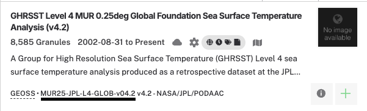

# Configuring a collection for bignbit

## What do I need?

To configure a collection for bignbit, you need to have the following information ready:

* **Short name**: The short name of your collection can be found in Earthdata Search or CMR. In the attached screenshot from a list of Earthdata Search results, the short name is the underlined field in small text. Note that the version next to it (the redundant v4.2 in this case) is NOT required.

* **Provider**: The CMR provider name for your collection. In the case of our example above, this would be `POCLOUD`, which can be found by checking the suffix of the collection id. In Earthdata Search, you will be able to see the collection id in the URL when clicking on the collection details.
* If applicable, the names of the data variables in the collection that should be converted to browse images. If you have a collection that uses COGs or otherwise does not have data variables, you do not need to specify a value for this option.
* Any specific details required for the generation of browse images from granules in this collection. If you're not sure what details are relevant, please refer to the abridged list of options for the dataset config creation script below.


## Usage

**If you are not sure how to run the script, please refer to the "Setup" section below.**

```
  provider              CMR provider name for the collection (e.g., POCLOUD)

  shortName             Short name of the collection

  --collectionId COLLECTIONID
                        CMR collection id, use if the collection name is ambiguous.
                        WARNING: since collection ids are venue-specific, the output config will need to be re-generated when deploying to a separate venue.

  --imageFilenameRegex IMAGEFILENAMEREGEX
                        Regular expression used to identify which file in a granule should be used as the image file.
                        Uses first if multiple files match

  --imgVariables VAR_NAME [VAR_NAME ...]
                        List of variable names (not UMM-Var concept ids) to use for generating browse image(s).
                        If none are provided, the default of "all" is used

  --dimensions HEIGHT WIDTH
                        Optional override to specify the height and width that each browse image should have when processed by Harmony.

  --scaleExtentPolar MINX MINY MAXX MAXY
                        Controls the geographic extent of polar-projected browse image outputs.
                        This keyword is ignored if `outputCrs` does not contain EPSG:3413 or EPSG:3031
                        (polar stereographic projections used by GIBS)

  --singleDayNumber JJJ
                        All granules in this dataset will use the day of year specified in this keyword. ex: "001" for January 1st

  --subdaily            Set to true if granules contain subdaily data. This will send `DataDateTime` metadata to GIBS as described in the GIBS ICD

  --outputCrs list of CRS strings from these options: EPSG:4326,EPSG:3413,EPSG:3031,EPSG:3857
                        List of output projections or coordinate reference systems for which to produce browse images. Applies to all variables in granule. GIBS-compatible values are EPSG:4326, EPSG:3413, or EPSG:3031
```

Additionally, you can provide the `--s3Destination` keyword if you wish to upload the dataset config directly to s3. You must have valid access credentials to your bucket in the environment you run the script if you wish to use this option.

```
  --s3Destination BUCKET KEY
                        Specify an S3 URI (bucket key, ex: --s3Destination podaac-bignbit-sit-svc-internal big-config) to upload the config. Do not specify the filename, it is auto-generated.
```

## Setup

1. Make sure you have set up the python environment by following the instructions from the Readme. While the instructions recommend `conda`, you can also install dependencies for bignbit using pip and a virtual environment. Once you have `conda activate bignbit` or your pip environment set up, you can run the script.
2. Run the script by invoking it from the command line: `./create_dataset_config.py <short_name> <provider> ...` or `python create_dataset_config.py <short_name> <provider> ...`. If you are not saving the output config to S3, it will be saved in the directory you ran the script.

## Examples

**GHRSST Level 4 MUR 0.25deg Global Foundation Sea Surface Temperature Analysis (v4.2)**: The short name for this collection is `MUR25-JPL-L4-GLOB-v04.2` and the provider is `POCLOUD`, so we can configure the collection by running this command:
```bash
./create_dataset_config.py POCLOUD MUR25-JPL-L4-GLOB-v04.2 --imgVariables analysed_sst sst_anomaly sea_ice_fraction --s3Destination podaac-bignbit-sit-svc-internal big-config
```
If I have access keys to the specified bucket in my environment, the script will upload the generated dataset config to S3. For this collection, the dimensions are not specified and therefore will match the source height and width for the granule.

**PREFIRE Spectral Flux from PREFIRE Satellite 1 COG R01**: Short name is `PREFIRE_SAT1_2B-FLX_COG` and provider is `LARC_CLOUD`. This collection has COG granules, but we specify an imgVariable of 'flx' anyways for metadata purposes. In this case we will NOT upload the dataset config to S3:
```bash
./create_dataset_config.py LARC_CLOUD PREFIRE_SAT1_2B-FLX_COG --imgVariables flx --dimensions 9000 18000 --outputCrs EPSG:3413 EPSG:4326 EPSG:3031 --scaleExtentPolar -4194304 -4194304 4194304 4194304 --imageFilenameRegex ".*.nc.G00.tif" --collectionId C3550250575-LARC_CLOUD --subdaily
```
Note that this particular dataset configuration will only be valid for the Production environment since we specified a collection concept id. You should avoid specifying collectionId unless it is required due to multiple collections having the same short_name.